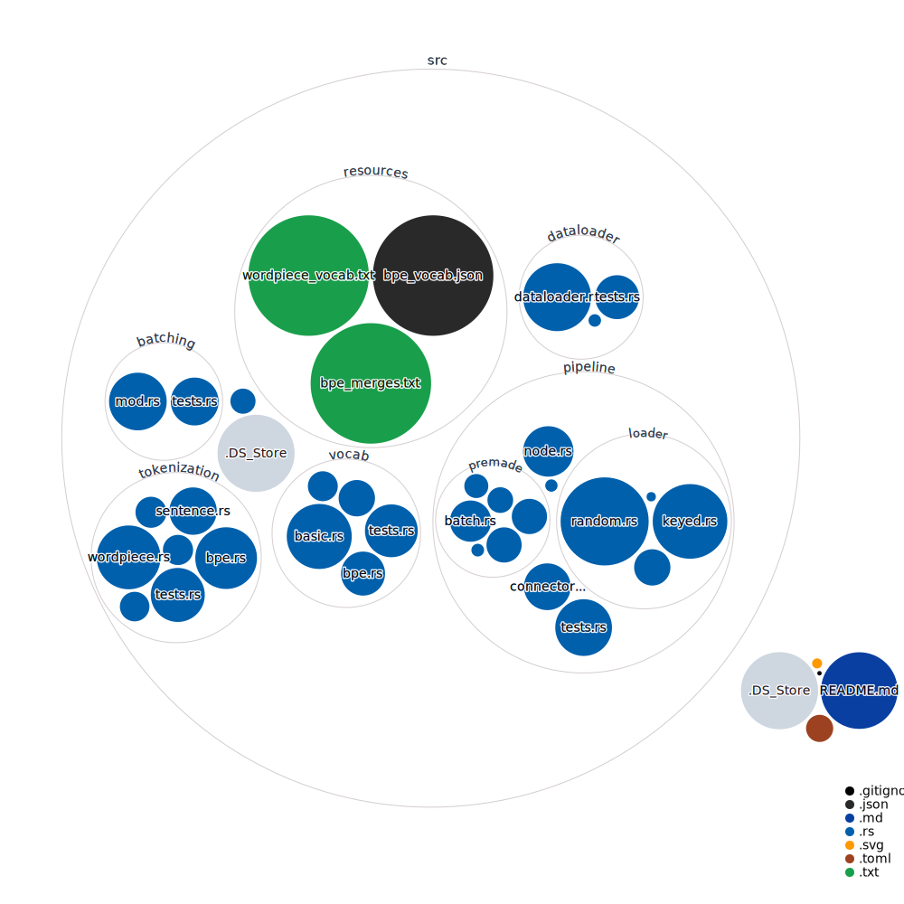

# Dataflow


[](https://github.com/Sidekick-AI/dataflow/actions)
[](https://crates.io/crates/dataflow)
[![Documentation](https://img.shields.io/badge/docs-online-5023dd.svg?style=for-the-badge&logoColor=white&logo=data:image/svg+xml;base64,PHN2ZyByb2xlPSJpbWciIHhtbG5zPSJodHRwOi8vd3d3LnczLm9yZy8yMDAwL3N2ZyIgdmlld0JveD0iMCAwIDUxMiA1MTIiPjxwYXRoIGZpbGw9IiNmNWY1ZjUiIGQ9Ik00ODguNiAyNTAuMkwzOTIgMjE0VjEwNS41YzAtMTUtOS4zLTI4LjQtMjMuNC0zMy43bC0xMDAtMzcuNWMtOC4xLTMuMS0xNy4xLTMuMS0yNS4zIDBsLTEwMCAzNy41Yy0xNC4xIDUuMy0yMy40IDE4LjctMjMuNCAzMy43VjIxNGwtOTYuNiAzNi4yQzkuMyAyNTUuNSAwIDI2OC45IDAgMjgzLjlWMzk0YzAgMTMuNiA3LjcgMjYuMSAxOS45IDMyLjJsMTAwIDUwYzEwLjEgNS4xIDIyLjEgNS4xIDMyLjIgMGwxMDMuOS01MiAxMDMuOSA1MmMxMC4xIDUuMSAyMi4xIDUuMSAzMi4yIDBsMTAwLTUwYzEyLjItNi4xIDE5LjktMTguNiAxOS45LTMyLjJWMjgzLjljMC0xNS05LjMtMjguNC0yMy40LTMzLjd6TTM1OCAyMTQuOGwtODUgMzEuOXYtNjguMmw4NS0zN3Y3My4zek0xNTQgMTA0LjFsMTAyLTM4LjIgMTAyIDM4LjJ2LjZsLTEwMiA0MS40LTEwMi00MS40di0uNnptODQgMjkxLjFsLTg1IDQyLjV2LTc5LjFsODUtMzguOHY3NS40em0wLTExMmwtMTAyIDQxLjQtMTAyLTQxLjR2LS42bDEwMi0zOC4yIDEwMiAzOC4ydi42em0yNDAgMTEybC04NSA0Mi41di03OS4xbDg1LTM4Ljh2NzUuNHptMC0xMTJsLTEwMiA0MS40LTEwMi00MS40di0uNmwxMDItMzguMiAxMDIgMzguMnYuNnoiPjwvcGF0aD48L3N2Zz4K)](https://docs.rs/dataflow/0.1.0/dataflow/)

Dataflow is a data processing library that provides composable primatives to build flexible, fast and statically typed data pipelines. The pipeline is a directed acyclic dataflow graph, which a dataloader can run on a seperate thread to feed data-hungry applications.

## Usage
To build a pipeline, first start with a loader Node:
```rust
use dataflow::pipeline::RandomLoader;

fn main() {
  let pipeline = RandomLoader::new(vec!["file1.txt".to_string(), "file2.txt".to_string()]);
}
```
The RandomLoader by default loads individual lines randomly from files. Next add a transformation to it with the `map()` function:
```rust
let pipeline = RandomLoader::new(vec!["file1.txt".to_string(), "file2.txt".to_string()])
      .map(|line| format!("Hello {}", line));
```
`map()` takes in a Node that processes a single sample at a time. If we want to do batch processing, we can use `.node()` which takes a Node that can process a batch at a time.

Important node: **All functions and closures are also Nodes!** This means that whenever we want to add a node, we could simple use a function. In this case, the closure takes in a single datapoint and outputs a single datapoint. 

Now we've added "Hello " to every line, let's use a tokenizer from `dataflow_nlp` in our pipeline:
```rust
// Our tokenizer
let tokenizer = dataflow_nlp::tokenization::WordpieceTokenizer::load();

// Our pipeline
let pipeline = RandomLoader::new(vec!["file1.txt".to_string(), "file2.txt".to_string()])
      .map(|lines| format!("Hello {}", line))
      .node(tokenizer); // This will tokenize the strings in batches

```
Great! Now our data gets efficiently tokenized in batches. Right now, we will get single tokenized sentences out of the pipeline one at a time. But what if we wanted to get batches out? Let's use a Batch node:
```rust

// Our tokenizer
let tokenizer = dataflow_nlp::tokenization::WordpieceTokenizer::load();

// Our pipeline
let pipeline = RandomLoader::new(vec!["file1.txt".to_string(), "file2.txt".to_string()])
      .map(|lines| format!("Hello {}", line))
      .node(tokenizer) // This will tokenize the strings in batches
      .node(Batch::new(64)); // We'll use 64 as the batch size
```
That's it! We'll now get batches of 64 tokenized sentences.

### Loader Nodes
So far it seems we've only used two types of Nodes, Stateless and Stateful (Stateless was generated when we used .add_fn(), and a Batch node is Stateless). Actually we used three, because RandomLoader is a Node as well! It takes as input Vec<()>, which is what the pipeline will start with, and produces data (Vec<String>) to send through the pipeline.
  
### Custom Nodes
In fact, you can implement your own Nodes as well, by implementing the `Node` trait! Just implement `fn process(Input) -> Output` in the trait, and optionally `fn reset(&mut)` which gets called at the beginning of an epoch, and `fn data_remaining(&self) -> usize` which should return how much data remains availiable to the node (the number of lines we haven't loaded yet for RandomLoader, or pass through the remaining data for a non-loader Node) and you have your own Node to integrate into the pipeline!
  
### Dataloader
Since we built this cool pipeline, what can we do with it? Well for starters, we could simply call process() and feed in some data:
```rust
// The RandomLoader takes in a () for each sample, so we pass in a batch as Vec<()>
let output: Vec<Vec<Vec<String>>> = pipeline.process(vec![(); 128])

// Output should now contain 2 batches of 64 tokenized sentences from our files with "Hello" prepended.
```

Let's do something cooler. Let's put it in a Dataloader and use it in an ML training loop:
```rust
// Make the dataloader
let mut dataloader = dataflow::dataloader::Dataloader(pipeline);

// Training loop
for example in &mut dataloader {
   // Now example is a vector of tokenized strings!
   // Do with them what you please...
}
```

To Do:
- [ ] Spin out all NLP related stuff into a dataflow-nlp crate.
- [ ] Make dataloader use a multiqueue instead of draining all examples into buffer on main thread
- [ ] Make auto-parallel pipeline Node using rayon
- [ ] Add async ability and remote sources.
- [ ] Simplify the type magic used to make functions-as-closures work. Allow implementation of Node directly. Remove duplicate impls of Node and ExplicitNode

## Codebase Visualization

